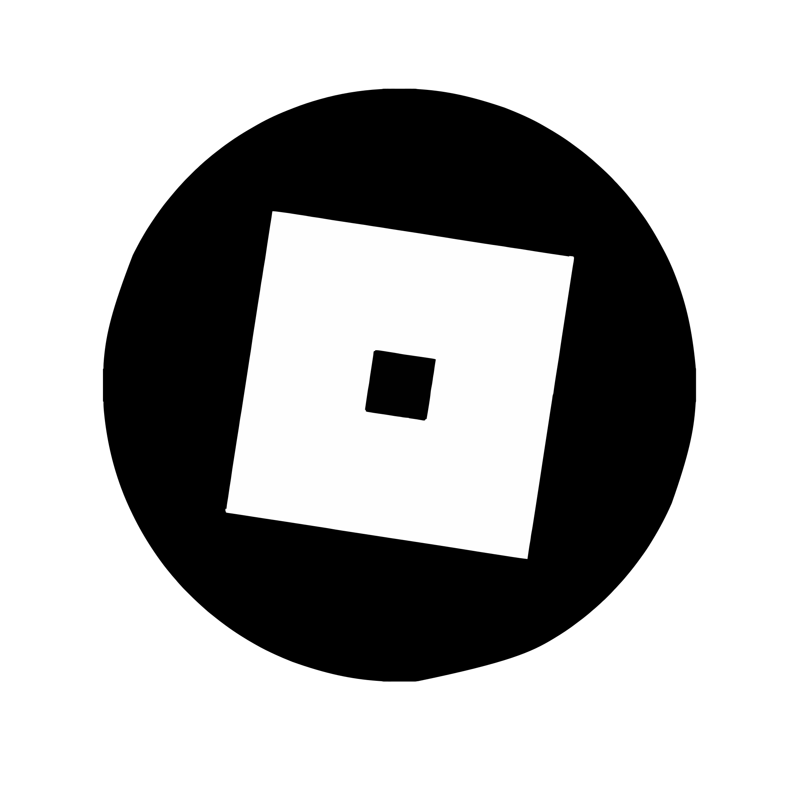

<div align="center">

# Hey, I'm Denzil <picture><source srcset="https://fonts.gstatic.com/s/e/notoemoji/latest/1f64c/512.webp" type="image/webp"></picture>

<br>

 
```js
Console.log("Rookie FullStack/Roblox Game Developer")
```

## About Me:(He/Him) <picture><source srcset="https://fonts.gstatic.com/s/e/notoemoji/latest/270f_fe0f/512.webp" type="image/webp"></picture>
  
###### 📍India, Banglore. ######


<p>I'm a Computer Science undergrad with a passion for full-stack development, cloud technologies, and game development. I’m actively working on real-world projects to sharpen my skills and learn by doing. I'm looking for opportunities where I can grow as a developer, gain hands-on experience, and contribute to building meaningful software solutions.</p>

[](https://git.io/streak-stats)

<details>
  <summary>More Abour me...</summary>

  
  ---
  
  ## My Socials:  <picture><source srcset="https://fonts.gstatic.com/s/e/notoemoji/latest/1f91d/512.webp" type="image/webp"></picture>
<p align="left"><a href="mailto:denzil1974.biz@gmail.com"><a href="https://www.linkedin.com/in/DenzilDeepak/"></a><a href="https://www.instagram.com/izzyyuniverse"></a> <a href="https://www.youtube.com/@Izzy_wastaken"></a>
<a href="https://discord.com/users/:1260528805861265535"></a></p>
  
## GameDev Socials: <picture><source srcset="https://fonts.gstatic.com/s/e/notoemoji/latest/1f3b2/512.webp" type="image/webp"></picture>

<a href="https://www.roblox.com/users/7035669180/profile"></a>  

## Known Technologies: <picture><source srcset="https://fonts.gstatic.com/s/e/notoemoji/latest/1f393/512.webp" type="image/webp"></picture>

<p align="left"></p>

---
</details>
</div>

#### last updated 3/8/2025 <picture><source srcset="https://fonts.gstatic.com/s/e/notoemoji/latest/1f6a7/512.webp" type="image/webp"></picture>
<!-- # (<div></div>)

[](https://discord.com/users/1260528805861265535) -->
